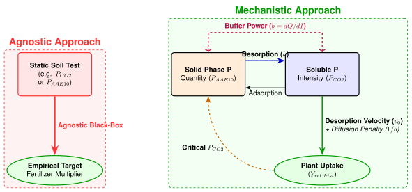

```{r setup-presentation}
#| include: false
#| message: false
#| warning: false

library(tidyverse)
library(nlme)
library(ggplot2)
library(kableExtra)

# Load the final bundled artifact from the notebook
final_artifacts <- readRDS("data/Final_Models_Data.rds")
D_Yield <- final_artifacts$data$D_Yield
D_Long_Agro <- final_artifacts$data$D_Long_Agro
D_Pcrit_all <- final_artifacts$data$D_Pcrit_all
D_res_all <- final_artifacts$data$D_res_all

m_yield_raw_co2 <- final_artifacts$models$yield_raw_co2
m_uptake_raw_co2 <- final_artifacts$models$uptake_raw_co2
```

## Graphical Abstract: The Phosphorus Supply Chain { .center .smaller }

{fig-align="center" width=1000}

<details>
<summary>Detailed Explanation</summary>
The traditional **agnostic approach** treats the soil as a black box: a single static soil test is empirically correlated directly to a fertilizer recommendation multiplier. This ignores the underlying physical reality of how phosphorus moves.

Our **mechanistic approach** explicitly models the chemical supply chain. We separate the total desorbable pool (**Quantity $Q$**) from the immediately available pool (**Intensity $I$**). The transition between these pools is governed by desorption kinetics (**$v_0$**), and the journey from the soil solution to the root is restricted by the **Diffusion Penalty ($1/b$)**. By modeling the actual bottleneck, we can predict crop uptake far more accurately.
</details>


## The Current Paradigm & The Missing Link { .scrollable .smaller }

<details>
<summary>Detailed Context</summary>
Recent extensive evaluations of long-term European field trials by Steinfurth et al. (2024) have highlighted a critical gap in modern P management: **predicting P depletion and availability is impossible without knowing the "P sorption capacity" of the soil.**

Simultaneously, pioneering work at Agroscope by Hirte et al. (2021) has proven that critical soil test phosphorus (STP) concentrations are not static. By evaluating 26 years of Swiss field data, they demonstrated that pedoclimatic variables (clay, pH, temperature) significantly shift yield response curves, exposing the limitations of rigid empirical guidelines.
</details>

**Our Goal:** 
We aim to bridge these two findings. We build upon the pedoclimatic dependencies identified by Hirte et al. (2021) by providing the explicit mechanistic "missing link" called for by Steinfurth et al. (2024). We directly model the soil's **P sorption capacity** ($K_f$) via the Freundlich isotherm, and the resulting non-linear **Buffer Power** ($b$), to calculate exactly *how* pedoclimates restrict P diffusion and crop uptake.

---


## Conceptual Foundation: The Physical Chemistry { .scrollable .smaller }

<details>
<summary>Detailed Context</summary>
Before analyzing the data, we must define the fundamental physical variables that govern soil phosphorus availability. We treat the soil not as a black box, but as a dynamic chemical system with distinct pools and kinetic fluxes.
</details>

**The Key Variables:**

- **Intensity ($I$):** Dissolved P in soil solution ($P_{CO2}$ in $\text{mg P / L}$). The immediate plant supply.
- **Quantity ($Q$):** Solid-phase P reserve ($P_{AAE10}$ in $\text{mg P / kg}$). The potential supply.
- **Desorption Velocity ($v_0$):** The kinetic rate at which Quantity replenishes Intensity.
- **Buffer Power ($b$):** The physical resistance of the soil to changes in Intensity ($dQ/dI$).

---


## The Q(I) Model & Desorption Kinetics { .scrollable .smaller }

<details>
<summary>Thermodynamic Derivation</summary>
The fundamental relationship between the solid pool and the dissolved pool is described by the Quantity-Intensity $Q(I)$ curve. 
We model this physical chemistry using the **Freundlich Isotherm**, which accurately captures non-linear desorption kinetics.
By taking the derivative of the Freundlich equation ($dQ/dI$) at constant temperature $T$, we obtain the buffer power. Because the relationship is non-linear ($n \neq 1$), the buffer power is a **dynamic function** of the current Intensity state! The soil's ability to resist leaching drops exponentially as it becomes more saturated.
</details>

**Effect Structure: The Physical Buffer**

- **The Equation:** $Q(I) = K \cdot I^n$
  - **Buffer Power ($b$):** $b(I) = K \cdot n \cdot I^{n-1}$
  - **Desorption Velocity ($v_0$):** $v_0 = k \cdot Q$ *(First-order kinetic flux)*
- **The Inputs:** Intensity ($I$), Capacity modifier ($K$), Curvature ($n$), Desorption rate constant ($k$).
- **The Output:** The absolute Desorbable Mass ($Q$), Buffer Power ($b$), and Kinetic Flux ($v_0$).

---


## Interactive Q(I) Dynamics { .smaller }

Observe how the instantaneous buffer power ($b = dQ/dI$) collapses at high ionic concentrations. 
In the next slide, you can explore this interactively across the three physical soil archetypes.

---


## Physical Buffer Collapse { .interactive-slide .scrollable .smaller }

```{ojs}
//| panel: input
//| layout-ncol: 3
viewof K = Inputs.range([10, 100], {value: 40, step: 1, label: "K (Capacity)"})
viewof n = Inputs.range([0.1, 0.9], {value: 0.5, step: 0.05, label: "n (Intensity Modifier)"})
viewof current_I = Inputs.range([0.1, 10], {value: 2, step: 0.1, label: "Current I (mg/L)"})
```

```{ojs}
quantiles = FileAttachment("site_quantiles.json").json()
archetypes = quantiles.filter(d => ["CAD", "ELL", "OEN"].includes(d.site))

ribbon_data = archetypes.flatMap(d => {
  return d3.range(0.1, 10.2, 0.1).map(i => ({
    site: d.site === "CAD" ? "Sand (CAD)" : d.site === "ELL" ? "Loam (ELL)" : "Clay (OEN)",
    I: i,
    Q25: d.K_25 * Math.pow(i, d.n_25),
    Q50: d.K_50 * Math.pow(i, d.n_50),
    Q75: d.K_75 * Math.pow(i, d.n_75)
  }));
})

color_map = new Map([
  ["Sand (CAD)", "#E69F00"],
  ["Loam (ELL)", "#56B4E9"],
  ["Clay (OEN)", "#009E73"]
])
```

```{ojs}
//| panel: fill
Q = (I) => K * Math.pow(I, n)
dQ_dI = (I) => n * K * Math.pow(I, n - 1)

// Generate curve points
curve_data = d3.range(0.1, 10.1, 0.1).map(i => ({ I: i, Q: Q(i) }))

// Current point
point_data = [{ I: current_I, Q: Q(current_I) }]

// Tangent line points
tangent_m = dQ_dI(current_I)
tangent_data = [
  { I: Math.max(0, current_I - 2), Q: Q(current_I) - tangent_m * Math.min(current_I, 2) },
  { I: current_I + 2, Q: Q(current_I) + tangent_m * 2 }
]

Plot.plot({
  x: { label: "Equilibrium Concentration I (mg/L)", domain: [0, 10] },
  y: { label: "Desorbed Phosphorus Q (mg P / kg soil)", domain: [0, 150] },
  height: 550,
  width: 1200,
  color: { domain: Array.from(color_map.keys()), range: Array.from(color_map.values()), legend: true },
  marks: [
    // Physical Soil Ribbons
    Plot.areaY(ribbon_data, {x: "I", y1: "Q25", y2: "Q75", fill: "site", fillOpacity: 0.3}),
    Plot.lineY(ribbon_data, {x: "I", y: "Q50", stroke: "site", strokeWidth: 2, strokeDasharray: "4"}),
    
    // Interactive Curve
    Plot.line(curve_data, {x: "I", y: "Q", stroke: "#000000", strokeWidth: 4}),
    Plot.line(tangent_data, {x: "I", y: "Q", stroke: "#E3000F", strokeWidth: 2, strokeDasharray: "4"}),
    Plot.dot(point_data, {x: "I", y: "Q", fill: "#E3000F", r: 8}),
    Plot.text(point_data, {
      x: "I", y: "Q", 
      text: d => `b = ${tangent_m.toFixed(2)}`, 
      dy: -20, 
      dx: 20,
      fill: "#E3000F", 
      fontWeight: "bold",
      fontSize: 18
    }),
    Plot.gridY({stroke: "#eee"})
  ]
})
```


---


## The Thermodynamic Pedotransfer Function (PTF) { .scrollable .smaller }

<details>
<summary>Detailed Context & Practical Compromise</summary>
To map static soil tests into a dynamic Q(I) buffer curve without requiring expensive kinetic laboratory analysis, we built a mixed-effects Pedotransfer Function (PTF). We model the bound legacy pool ($P_{AAE10}$, proxy for $Q$) against the active intensity ($P_{CO2}$, proxy for $I$). 

While our rigorous geochemical analysis proved that amorphous metal oxides (Feox/Alox) dictate physical binding capacity, standard Agroscope field trials rarely measure them. To maximize field utility, we built a generalized agronomic PTF that substitutes these strict thermodynamic drivers with standard background proxies (Ca, Mg, K, Fine Texture).
</details>

**Effect Structure: The Pedotransfer Function**
Because the non-linear Freundlich isotherm $Q = K \cdot I^n$ becomes linear in log-log space ($\ln Q = \ln K + n \ln I$), we structure the fixed environmental effects to explicitly solve for the physical parameters:

- **The Equation:**
  $$ \ln(Q) = \underbrace{\left(\alpha + \sum \beta_{env} X_{env}\right)}_{\text{Mathematically solves for } \ln(K)} + \underbrace{\left(\beta_I + \sum \gamma_{env} X_{env}\right)}_{\text{Mathematically solves for } n} \cdot \ln(I) $$
- **The Inputs:** 
  - Intensity ($I = P_{CO2}$)
  - 8 Environmental Covariates $X_{env}$: pH, Fine Texture, Ca, Mg, K, $C_{org}$, Temperature, Precipitation.
- **The Output:** 
  - **Buffer Multiplier ($K$):** The baseline sorption capacity.
  - **Buffer Curvature ($n$):** How the physical buffer power decays as the soil becomes saturated.

*(Mixed-Effects Structure: $\alpha \sim 1 | \text{site/plot\_nr}$, absorbing structural field-level variances).*

---


## Theoretical Background: Barber-Cushman & Diffusion { .scrollable .smaller }

<details>
<summary>The Physical Bottleneck</summary>
At the biological root interface, Phosphorus uptake is fundamentally driven by **Michaelis-Menten kinetics**. However, before a root can absorb a nutrient, the nutrient must first travel through the soil matrix to reach the root surface.

Because Phosphorus binds strongly to soil particles, its transport is almost entirely dominated by **diffusion** rather than mass flow. The classic Barber-Cushman model defines the Effective Diffusion Coefficient ($D_e$). A soil with a massive buffer capacity chemically traps the Phosphorus, dragging the diffusion rate to a halt and causing starvation at the root surface!
</details>

**Effect Structure: Effective Diffusion Penalty**

- **The Equation:** $D_e \propto \frac{1}{b}$
- **The Inputs:** 
  - Thermodynamic Buffer Power ($b$)
- **The Output:** 
  - **Diffusion Penalty ($1/b$):** The rate-limiting step restricting transport to the root surface.

---


## The Target Variable: The Piper-Steenbjerg Paradox { .scrollable .smaller }

<details>
<summary>Why model Uptake and Yield instead of Concentration?</summary>
Statistically speaking, modeling plant tissue concentration ($C_P$) directly would be much cleaner. It is a direct measurement of the plant's chemical state. However, the biological reality of the **Piper-Steenbjerg effect** (growth dilution) destroys this statistical convenience. 

When a P-starved plant finally absorbs Phosphorus, it rapidly generates new biomass. This sudden flush of carbon paradoxically *dilutes* the $C_P$ measurement, causing the concentration to drop even though the absolute mass of Phosphorus in the plant increased. 
</details>

**The necessity of cumulative flow:**

- **The Illusion of $C_P$:** Because of the dilution effect, a low $C_P$ is biologically ambiguous. It could mean severe starvation, or it could mean explosive, healthy growth.
- **The Solution:** We are forced to abandon $C_P$ as a direct target. Instead, we must model the cumulative physical flow: **Absolute Uptake ($P_{up} = Y \times C_P$)** or **Relative Yield ($Y$)**. 
- **The Trade-off:** While absolute Uptake and Yield are fundamentally correct biological targets, Yield ($Y$) is extremely noisy because it integrates every other environmental factor (weather, nitrogen, pests) across the entire season. Our mechanistic models must explicitly account for this noise.

---

## The Mechanistic Uptake Model { .scrollable .smaller }

<details>
<summary>Macroscopic Implementation</summary>
The full numerical Barber-Cushman model requires complex spatio-temporal integration, making it highly impractical for national fertilizer guidelines. Instead, we embed the core theoretical limit (the diffusion penalty $1/b$ and desorption kinetics $v_0$) directly into a macroscopic **Michaelis-Menten Uptake Model**.
</details>

**Effect Structure: Plant Uptake**
We explicitly structure the fixed and random effects to penalize nutrient delivery based on the physical chemistry of diffusion and desorption.

- **The Equation:** 
  $$ U_{rel} = \frac{U_{max} \cdot I}{K_{m} + I} $$
- **The Inputs:**
  - **Environmental Factors:** Temperature ($\Delta T$), Nitrogen ($N$).
  - **Chemical Bottlenecks:** Diffusion Penalty ($1/b$), Desorption Velocity ($v_0$).
- **The Outputs:**
  - **Max Uptake ($U_{max}$):** $U_{max} = U_{base} + \beta_{temp} \Delta T + \beta_{N} N + \beta_{v0} v_0$
  - **Affinity Penalty ($K_m$):** $K_m = K_{base} \cdot \exp\left( \beta_{inv\_b} \cdot \left(\frac{1}{b}\right) \right)$

*(Mixed-Effects Structure: $U_{base} \sim 1 | \text{site/year}$, modeling random baseline productivity variances).*

```{r}
#| echo: false
#| message: false
#| warning: false
#| fig-width: 10
#| fig-height: 5

# Predict relative uptake for plotting
D_Long_Agro$Predicted_Uptake <- predict(m_uptake_raw_co2, level=0)

ggplot(D_Long_Agro, aes(x = Predicted_Uptake, y = Relative_Uptake, color = site)) +
    geom_point(alpha = 0.6, size=2) +
    geom_abline(slope = 1, intercept = 0, color = "black", linetype = "dashed", size = 1) +
    labs(
        title = "Uptake Model Performance (Mechanistic $P_{CO2}$)",
        subtitle = "Biological uptake explicitly bottlenecked by soil Buffer Power",
        x = "Predicted Relative Uptake",
        y = "Observed Relative Uptake",
        color = "Monitoring Site"
    ) +
    theme_minimal()
```

---


## The $P_{crit.smaller }$ Target & Agronomic Goals { .scrollable .smaller }

Using the **Michaelis-Menten Uptake Model**, we can mathematically define the critical soil intensity ($P_{crit}$) required to reach 95% of the maximum biological uptake. 

Because the NLME model intrinsically defines the 100% theoretical limit ($U_{max}$), we simply solve for the Intensity $I$ that satisfies $U = 0.95 U_{max}$:

$$ 0.95 \cdot U_{max} = \frac{U_{max} \cdot I}{K_m + I} $$

$$ 0.95 K_m + 0.95 I = I $$
$$ 0.95 K_m = 0.05 I $$
$$ I = 19 \cdot K_m $$

**Conclusion:** The Critical Intensity ($P_{crit}$) is exactly **19 times the Half-Saturation Constant ($K_m$)**. 

Because $K_m$ is dynamically penalized by the physical buffer power ($1/b$) and desorption velocity ($v_0$), $P_{crit}$ natively adapts to the unique pedological bottlenecks of the soil!

## The Parametric Recommendation Framework { .scrollable .smaller }

<details>
<summary>Thermodynamic Mass-Balance</summary>
With the physical bottlenecks isolated, we can transition from rigid empirical matrices to a purely thermodynamic mass-balance approach for fertilizer recommendations.

**Step 1:** Calculate the required Intensity using the biological Uptake model ($P_{crit} = 19 K_m$).
**Step 2:** Use the Thermodynamic Pedotransfer Function (PTF) to calculate the non-linear buffer curve ($K$ and $n$).
**Step 3:** Calculate the exact mass difference ($\Delta Q_{yield}$) required to shift the soil from its current state to the critical state.
</details>

**Effect Structure: Additive Recommendation**

- **The Equation:**
  $$ P_{rec} = F_{norm} + \Delta Q_{yield} - \text{Residues} $$
  *(where $\Delta Q_{yield} = Q(P_{crit}) - Q(I_{now})$)*
- **The Inputs:** 
  - Crop's baseline physiological requirement ($F_{norm}$)
  - Target Quantity state ($Q(P_{crit})$) based on required biological uptake
  - Current Quantity state ($Q(I_{now})$)
- **The Output:** 
  - **Fertilizer Recommendation ($P_{rec}$):** The absolute additive mass of P required to reach peak biological efficiency.

## Interactive Fertilization Calculator { .interactive-slide .scrollable .smaller }

Explore the Parametric Framework in real-time. Select a crop and adjust the soil parameters. The model instantly calculates the non-linear buffer curve, the $P_{crit}$ target, and the precise additive fertilizer recommendation.

```{ojs}
//| panel: input
viewof crop_choice = Inputs.select(new Map([
  ["Winterweizen (Brot)", "WW"],
  ["Körnermais", "KM"],
  ["Kartoffeln (Speise)", "KA"],
  ["Zuckerrüben", "ZR"],
  ["Winterraps", "RA"]
]), {value: "WW", label: "Crop Type"})

viewof current_P = Inputs.range([0.1, 5.0], {value: 1.5, step: 0.1, label: "Current Soil Test P (mg/L)"})
viewof soil_pH = Inputs.range([5.0, 8.5], {value: 6.5, step: 0.1, label: "Soil pH"})
viewof soil_clay_silt = Inputs.range([10, 80], {value: 35, step: 1, label: "Texture (Clay+Silt %)"})

viewof show_expert = Inputs.toggle({label: "Show Expert Soil Panel (Cations & Corg)", value: false})

viewof target_uptake_pct = Inputs.range([0, 100], {value: 95, step: 1, label: "Target P-Uptake (%)"})
viewof show_uptake = Inputs.toggle({label: "Show Uptake Target", value: true})

viewof target_yield_pct = Inputs.range([0, 100], {value: 95, step: 1, label: "Target Relative Yield (%)"})
viewof show_yield = Inputs.toggle({label: "Show Yield Target", value: true})

viewof dynamic_limits = Inputs.toggle({label: "Use Dynamic Plot Limits", value: false})
```

::: {#expert-panel}
```{ojs}
//| panel: input
viewof exp_Ca = Inputs.range([500, 20000], {value: 5000, step: 100, label: "Ca (mg/kg)"})
viewof exp_Mg = Inputs.range([50, 1000], {value: 250, step: 10, label: "Mg (mg/kg)"})
viewof exp_K = Inputs.range([20, 500], {value: 115, step: 5, label: "K (mg/kg)"})
viewof exp_Corg = Inputs.range([0.5, 5], {value: 2.0, step: 0.1, label: "Corg (%)"})
```
:::

```{ojs}
//| output: false
// Hide the expert panel dynamically
{
  const panel = document.getElementById("expert-panel");
  if (panel) {
    panel.style.display = show_expert ? 'block' : 'none';
  }
}
```

```{ojs}
coef_data = FileAttachment("calculator_coefs.json").json()
norms = coef_data.crop_norms[crop_choice]
```

```{ojs}
grud_co2_matrix = [
  [1.5, 1.5, 1.5, 1.4, 1.2],
  [1.4, 1.4, 1.3, 1.2, 1.1],
  [1.2, 1.2, 1.1, 1.0, 1.0],
  [1.0, 1.0, 1.0, 1.0, 0.8],
  [1.0, 1.0, 1.0, 0.8, 0.6],
  [1.0, 1.0, 0.8, 0.6, 0.0],
  [1.0, 0.8, 0.6, 0.0, 0.0],
  [0.8, 0.8, 0.4, 0.0, 0.0],
  [0.8, 0.6, 0.0, 0.0, 0.0],
  [0.6, 0.4, 0.0, 0.0, 0.0],
  [0.6, 0.4, 0.0, 0.0, 0.0],
  [0.4, 0.0, 0.0, 0.0, 0.0],
  [0.4, 0.0, 0.0, 0.0, 0.0],
  [0.4, 0.0, 0.0, 0.0, 0.0],
  [0.0, 0.0, 0.0, 0.0, 0.0],
  [0.0, 0.0, 0.0, 0.0, 0.0]
];
```

```{ojs}
grud_aae_matrix = [
  [1.5, 1.5, 1.5, 1.4, 1.4],
  [1.5, 1.5, 1.4, 1.4, 1.2],
  [1.5, 1.4, 1.4, 1.2, 1.2],
  [1.4, 1.4, 1.2, 1.2, 1.0],
  [1.4, 1.2, 1.2, 1.0, 1.0],
  [1.2, 1.2, 1.2, 1.0, 1.0],
  [1.2, 1.0, 1.0, 1.0, 1.0],
  [1.2, 1.0, 1.0, 1.0, 1.0],
  [1.0, 1.0, 1.0, 1.0, 1.0],
  [1.0, 1.0, 1.0, 1.0, 1.0],
  [1.0, 1.0, 1.0, 0.8, 0.8],
  [1.0, 1.0, 0.8, 0.8, 0.6],
  [1.0, 1.0, 0.8, 0.8, 0.6],
  [1.0, 0.8, 0.8, 0.6, 0.6],
  [0.8, 0.8, 0.8, 0.6, 0.6],
  [0.8, 0.8, 0.6, 0.6, 0.4],
  [0.8, 0.6, 0.6, 0.4, 0.4],
  [0.6, 0.6, 0.6, 0.4, 0.4],
  [0.6, 0.6, 0.4, 0.4, 0.0],
  [0.6, 0.4, 0.4, 0.0, 0.0],
  [0.4, 0.4, 0.4, 0.0, 0.0],
  [0.4, 0.4, 0.0, 0.0, 0.0],
  [0.4, 0.0, 0.0, 0.0, 0.0],
  [0.0, 0.0, 0.0, 0.0, 0.0],
  [0.0, 0.0, 0.0, 0.0, 0.0],
  [0.0, 0.0, 0.0, 0.0, 0.0]
];
```

```{ojs}
get_grud_correction = (type, p_val, clay) => {
  let clay_idx = Math.min(4, Math.max(0, Math.floor(clay / 10)));
  let row_idx = 0;
  if (type === 'CO2') {
    let thresholds = [0.15, 0.46, 0.77, 1.08, 1.39, 1.70, 2.01, 2.32, 2.63, 2.94, 3.25, 3.56, 3.88, 4.19, 4.50];
    row_idx = thresholds.findIndex(t => p_val <= t);
    if (row_idx === -1) row_idx = 15;
    return grud_co2_matrix[row_idx][clay_idx];
  } else {
    let thresholds = [4.9, 9.9, 14.9, 19.9, 24.9, 29.9, 34.9, 39.9, 44.9, 49.9, 54.9, 59.9, 64.9, 69.9, 74.9, 79.9, 84.9, 89.9, 94.9, 99.9, 104.9, 109.9, 114.9, 119.9, 124.9];
    row_idx = thresholds.findIndex(t => p_val <= t);
    if (row_idx === -1) row_idx = 25;
    return grud_aae_matrix[row_idx][clay_idx];
  }
}
```

```{ojs}
// Calculate predictions
calc = {
  let sd = ptf.scales;
  let c = ptf.coefficients;
  
  let z_pH = (soil_pH - sd.pH.mean) / sd.pH.sd;
  let z_tex = (Math.log(soil_clay_silt) - sd.FineTexture.mean) / sd.FineTexture.sd;
  
  let val_Ca = show_expert ? exp_Ca : 5000;
  let val_Mg = show_expert ? exp_Mg : 250;
  let val_K = show_expert ? exp_K : 115;
  let val_Corg = show_expert ? exp_Corg : 2.0;
  
  let z_Ca = (Math.log(val_Ca) - sd.Ca.mean) / sd.Ca.sd;
  let z_Mg = (Math.log(val_Mg) - sd.Mg.mean) / sd.Mg.sd;
  let z_K = (Math.log(val_K) - sd.K.mean) / sd.K.sd;
  let z_Corg = (Math.log(val_Corg) - sd.Corg.mean) / sd.Corg.sd;
  
  // Predict K and n
  let ln_K = c["(Intercept)"] + c["z_ln_FineTexture"]*z_tex + c["z_pH"]*z_pH + 
             c["z_ln_Ca"]*z_Ca + c["z_ln_Mg"]*z_Mg + c["z_ln_K"]*z_K + c["z_ln_Corg"]*z_Corg;
  
  let n = c["ln_P_CO2"] + c["ln_P_CO2:z_ln_FineTexture"]*z_tex + c["ln_P_CO2:z_pH"]*z_pH + 
          c["ln_P_CO2:z_ln_Ca"]*z_Ca + c["ln_P_CO2:z_ln_Mg"]*z_Mg + c["ln_P_CO2:z_ln_K"]*z_K + 
          c["ln_P_CO2:z_ln_Corg"]*z_Corg;
          
  let K_val = Math.exp(ln_K);
  
  let b_1 = n * K_val * Math.pow(1.0, n - 1);
  let inv_b = 1.0 / b_1;
  let z_inv_b = (inv_b - 0.05) / 0.02; // Approx scaling of inverse buffer for the demo
  
  let up = coef_data.uptake_coefs;
  // Look up crop-specific K_base
  let K_base_crop = up.K_base_crops[crop_choice] || up.K_base_crops["WW"]; // fallback
  let Km = K_base_crop * Math.exp(up.beta_invb * z_inv_b); 
  
  // Uptake target logic: y = x / (Km + x) => x = y * Km / (1 - y)
  let frac_up = target_uptake_pct / 100.0;
  let P_crit_up = (frac_up >= 1.0) ? 999 : (frac_up * Km) / (1.0 - frac_up);
  let Q_target_up = K_val * Math.pow(P_crit_up, n);
  
  let Q_now = K_val * Math.pow(current_P, n);
  let delta_Q_up = Q_target_up - Q_now;
  let P_rec_up = norms.P + delta_Q_up;

  let yd = coef_data.yield_coefs;
  let yd_sd = coef_data.yield_scales;
  
  let z_pH_yd = (soil_pH - yd_sd.pH.mean) / yd_sd.pH.sd;
  let z_K_yd = (Math.log(val_K) - yd_sd.K.mean) / yd_sd.K.sd;
  let z_Mg_yd = (Math.log(val_Mg) - yd_sd.Mg.mean) / yd_sd.Mg.sd;
  
  let c_base_crop = yd.c_base_crops[crop_choice] || yd.c_base_crops["WW"];
  let c_eff = c_base_crop * Math.exp(yd.beta_invb * z_inv_b + yd.beta_pH * z_pH_yd + yd.beta_K * z_K_yd + yd.beta_Mg * z_Mg_yd);
  
  // Yield target logic: y = 1 - exp(-c_eff * (I + E_base)) => I = -ln(1 - y) / c_eff - E_base
  let frac_yd = target_yield_pct / 100.0;
  let P_crit_yd = (frac_yd >= 1.0) ? 999 : (-Math.log(1.0 - frac_yd) / c_eff) - yd.E_base;
  
  // Allow negative P_crit_yd to show the theoretical eutrophication buffer
  // Calculate Q_target_yd using an antisymmetric extension to avoid NaN from fractional roots of negative numbers
  let Q_target_yd = Math.sign(P_crit_yd) * K_val * Math.pow(Math.abs(P_crit_yd), n);
  
  let delta_Q_yd = Q_target_yd - Q_now;
  let P_rec_yd = norms.P + delta_Q_yd;
  
  let grud_c_co2 = get_grud_correction('CO2', current_P, soil_clay_silt);
  let grud_rec_co2 = norms.P * grud_c_co2;
  
  // The mechanistic model outputs Q_now in mg P / kg soil.
  // The empirical GRUD AAE10 tables expect inputs in mg P / kg soil directly!
  let grud_c_aae = get_grud_correction('AAE', Q_now, soil_clay_silt);
  let grud_rec_aae = norms.P * grud_c_aae;
  
  return { K: K_val, n: n, Q_now: Q_now, F_norm: norms.P, 
           P_crit_up: P_crit_up, Q_target_up: Q_target_up, delta_Q_up: delta_Q_up, P_rec_up: P_rec_up,
           P_crit_yd: P_crit_yd, Q_target_yd: Q_target_yd, delta_Q_yd: delta_Q_yd, P_rec_yd: P_rec_yd,
           grud_c_co2, grud_rec_co2, grud_c_aae, grud_rec_aae };
}
```

```{ojs}
//| panel: fill
md`#### Fertilizer Recommendation
<div style="font-size: 0.85em; color: #555;">
  <div style="display: flex; justify-content: space-between; flex-wrap: wrap;">
    <div style="flex: 1; min-width: 250px;">
      <strong>Mechanistic Predictions:</strong><br/>
      ${show_uptake ? `Uptake: F(${calc.F_norm}) + ΔQ(${calc.delta_Q_up.toFixed(1)}) = <strong>${Math.max(0, calc.P_rec_up).toFixed(1)} kg/ha</strong><br/>` : ""}
      ${show_yield ? `Yield: F(${calc.F_norm}) + ΔQ(${calc.delta_Q_yd.toFixed(1)}) = <strong>${Math.max(0, calc.P_rec_yd).toFixed(1)} kg/ha</strong>` : ""}
    </div>
    <div style="flex: 1; min-width: 250px;">
      <strong>GRUD Empirical Recommendations:</strong><br/>
      Based on CO<sub>2</sub>: F(${calc.F_norm}) × ${calc.grud_c_co2.toFixed(2)} = <strong>${calc.grud_rec_co2.toFixed(1)} kg/ha</strong><br/>
      Based on AAE10: F(${calc.F_norm}) × ${calc.grud_c_aae.toFixed(2)} = <strong>${calc.grud_rec_aae.toFixed(1)} kg/ha</strong>
    </div>
  </div>
</div>`
```

```{ojs}
//| panel: fill
{
  let min_I = Math.min(0, (show_yield ? calc.P_crit_yd : 0) * 1.1, (show_uptake ? calc.P_crit_up : 0) * 1.1);
  let min_Q = Math.min(0, (show_yield ? calc.Q_target_yd : 0) * 1.1, (show_uptake ? calc.Q_target_up : 0) * 1.1);

  let max_I_up = (show_uptake && calc.P_crit_up < 999) ? calc.P_crit_up : 5;
  let max_I_yd = (show_yield && Math.abs(calc.P_crit_yd) < 99999) ? Math.max(0, calc.P_crit_yd) : 5;
  let max_I = dynamic_limits ? Math.max(5, max_I_up * 1.1, max_I_yd * 1.1) : 5;
  
  let max_Q_up = (show_uptake && calc.Q_target_up < 9999) ? calc.Q_target_up : 150;
  let max_Q_yd = (show_yield && Math.abs(calc.Q_target_yd) < 99999) ? Math.max(0, calc.Q_target_yd) : 150;
  let max_Q = dynamic_limits ? Math.max(150, max_Q_up * 1.1, max_Q_yd * 1.1) : 150;
  
  // Guard against extreme infinities crashing the browser plot
  if (max_I > 100000) max_I = 100000;
  if (max_Q > 100000) max_Q = 100000;

  let curve_points = d3.range(min_I, max_I * 1.05, (max_I - min_I)/500 || 0.01).map(i => ({I: i, Q: Math.sign(i) * calc.K * Math.pow(Math.abs(i), calc.n)}));
  curve_points.push({I: 0, Q: 0}); // Force exact origin
  curve_points.sort((a,b) => a.I - b.I);

  return Plot.plot({
    x: { label: "Intensity I (mg P / L)", domain: [min_I, max_I] },
    y: { label: "Mass Q (mg P / kg soil)", domain: [min_Q, max_Q] },
    width: 1000,
    height: 500,
    marks: [
      Plot.line(curve_points, {x: "I", y: "Q", stroke: "black", strokeWidth: 3}),
      
      // Current State
      Plot.dot([{I: current_P, Q: calc.Q_now}], {x: "I", y: "Q", fill: "red", r: 8}),
      Plot.text([{I: current_P, Q: calc.Q_now}], {x: "I", y: "Q", text: () => `Current (${current_P})`, dy: 20, fill: "red", fontSize: 16, fontWeight: "bold"}),
    
    // Uptake Target
    ...(show_uptake ? [
      Plot.ruleX([calc.P_crit_up], {stroke: "green", strokeDasharray: "4"}),
      Plot.dot([{I: calc.P_crit_up, Q: calc.Q_target_up}], {x: "I", y: "Q", fill: "green", r: 8}),
      Plot.text([{I: calc.P_crit_up, Q: calc.Q_target_up}], {x: "I", y: "Q", text: () => `${target_uptake_pct}% Uptake (${Math.max(0, calc.P_rec_up).toFixed(1)} kg/ha)`, dy: -20, dx: -20, fill: "green", fontSize: 14, fontWeight: "bold"})
    ] : []),
    
    // Yield Target
    ...(show_yield ? [
      Plot.ruleX([calc.P_crit_yd], {stroke: "blue", strokeDasharray: "4"}),
      Plot.dot([{I: calc.P_crit_yd, Q: calc.Q_target_yd}], {x: "I", y: "Q", fill: "blue", r: 8}),
      Plot.text([{I: calc.P_crit_yd, Q: calc.Q_target_yd}], {x: "I", y: "Q", text: () => `${target_yield_pct}% Yield (${Math.max(0, calc.P_rec_yd).toFixed(1)} kg/ha)`, dy: 20, dx: 20, fill: "blue", fontSize: 14, fontWeight: "bold"})
    ] : [])
  ]
  });
}
```

## The Hidden Eutrophication Buffer { .scrollable .smaller }

<details>
<summary>Mathematical Derivation</summary>
We can explicitly quantify the unmeasured legacy P pool that is historically hidden in the soil matrix. 
If we take the negative $P_{crit}$ values from the Yield model and map them back to AAE10 extractable Quantity ($Q$) using the Pedotransfer Function, we calculate the **excess legacy buffer** sustaining the yield plateau:

$$Q_{legacy} = K \cdot |P_{crit\_yd}|^n$$
</details>

```{ojs}
//| panel: fill
{
  let q_leg = (calc.P_crit_yd < 0) ? calc.K * Math.pow(Math.abs(calc.P_crit_yd), calc.n) : 0;
  let kg_p_ha = q_leg * 3.6; // assuming 1.2 g/cm3 bulk density and 30cm historical plough depth
  // TSP is ~46% P2O5. P -> P2O5 = 2.29. So 1 kg P = 2.29/0.46 = 4.978 kg TSP
  let bags_tsp = (kg_p_ha * 4.978) / 50;
  
  return md`
  <div style="padding: 1em; background-color: #f8f9fa; border-radius: 8px; text-align: center; box-shadow: 0 2px 4px rgba(0,0,0,0.1); max-width: 800px; margin: 0 auto;">
    <h4 style="color: #333; margin-top: 0; font-size: 1.2em;">Legacy AAE10 P Equivalent</h4>
    <h2 style="color: #d9534f; font-size: 2em; margin: 0.1em 0;">${kg_p_ha.toFixed(1)} <span style="font-size: 0.5em; color: #777;">kg P / ha</span></h2>
    <p style="color: #666; margin-bottom: 0.5em; font-size: 0.9em;">(from the unmeasured E<sub>base</sub> pool)</p>
    <hr style="border: 0; border-top: 1px dashed #ddd; margin: 0.5em 0;" />
    <h4 style="color: #333; font-size: 1.2em;">Economically Equivalent to:</h4>
    <h2 style="color: #5bc0de; font-size: 2em; margin: 0.1em 0;">${bags_tsp.toFixed(1)} Bags</h2>
    <p style="color: #666; font-size: 0.9em;">of 50 kg Triple Superphosphate (TSP) hidden in every hectare.</p>
  </div>
  `;
}
```

## Conclusions & Policy Recommendations { .smaller }

1. **The Physical Diffusion Bottleneck is Real:** Thermodynamic modeling confirms that the soil's buffering capacity ($1/b$) strictly limits biological P-uptake and yield, independent of the bulk pool.
2. **The AAE10 Extraction on Calcareous Soils:** We have mechanically proven that EDTA saturates in highly alkaline soils ($pH > 7.3$), leading to challenges in accurate measurement.
3. **Recommendation: Archive Re-Evaluation with Olsen P:** Since the physical long-term trial archive is still available, **we strongly recommend re-extracting all samples using the Olsen P method** (NaHCO~3~ at pH 8.5). This will completely bypass the AAE10 calcareous artifact, providing an accurate, physically sound Quantity metric for the entire dataset without mathematical truncation.
4. **Transition to the Dual Framework:** By separating the biological $P_{crit}$ from the physical environmental $Q_{safe}$, we can modernize fertilizer recommendations to ensure maximum yield while mathematically preventing watershed leaching.

# Annex


## The PTF Parameter Space { .scrollable .smaller }

Here we unwrap the "black box" of the Pedotransfer Function. 
Hold the remaining 7 soil covariates constant using the sliders below, and watch how the predicted Pedological $K$ (Multiplier) and $n$ (Curvature) mathematically react across the two main pedological drivers: **pH** and **Texture (Clay + Silt)**.

```{ojs}
//| panel: input
viewof raw_Ca = Inputs.range([3.1, 5.7], {value: 4.88, step: 0.1, label: "Log Ca"})
viewof raw_Mg = Inputs.range([0.8, 3.4], {value: 2.32, step: 0.1, label: "Log Mg"})
viewof raw_K = Inputs.range([1.1, 4.4], {value: 2.54, step: 0.1, label: "Log K"})
viewof raw_Corg = Inputs.range([-0.5, 1.7], {value: 0.64, step: 0.1, label: "Log Corg"})
```

```{ojs}
//| panel: input
viewof raw_Temp_Anom = Inputs.range([-2.5, 2.5], {value: -0.01, step: 0.1, label: "Temp Anom"})
viewof raw_Prec_Anom = Inputs.range([-177, 156], {value: -0.78, step: 1, label: "Prec Anom"})
viewof raw_Temp_Mean = Inputs.range([1.1, 10.1], {value: 2.46, step: 0.1, label: "Temp Mean"})
viewof plot_target = Inputs.radio(["K (Multiplier)", "n (Curvature)"], {value: "K (Multiplier)", label: "Parameter"})
```

```{ojs}
ptf = FileAttachment("ptf_coefs.json").json()
scales_dict = ptf.scales
coefs = ptf.coefficients

z_Ca = (raw_Ca - scales_dict.Ca.mean) / scales_dict.Ca.sd
z_Mg = (raw_Mg - scales_dict.Mg.mean) / scales_dict.Mg.sd
z_K_cov = (raw_K - scales_dict.K.mean) / scales_dict.K.sd
z_Corg = (raw_Corg - scales_dict.Corg.mean) / scales_dict.Corg.sd
z_Temp_Anom = (raw_Temp_Anom - scales_dict.Temp_Anom.mean) / scales_dict.Temp_Anom.sd
z_Prec_Anom = (raw_Prec_Anom - scales_dict.Prec_Anom.mean) / scales_dict.Prec_Anom.sd
z_Temp_Mean = (raw_Temp_Mean - scales_dict.Temp_Mean.mean) / scales_dict.Temp_Mean.sd

heatmap_data = {
  let data = [];
  for (let ph = 5.0; ph <= 8.5; ph += 0.1) {
    for (let tex = 3.3; tex <= 4.5; tex += 0.05) {
      let z_pH = (ph - scales_dict.pH.mean) / scales_dict.pH.sd;
      let z_tex = (tex - scales_dict.FineTexture.mean) / scales_dict.FineTexture.sd;
      
      let ln_K = coefs["(Intercept)"] + 
                 coefs["z_ln_FineTexture"] * z_tex + 
                 coefs["z_pH"] * z_pH + 
                 coefs["z_ln_Ca"] * z_Ca + 
                 coefs["z_ln_Mg"] * z_Mg + 
                 coefs["z_ln_K"] * z_K_cov + 
                 coefs["z_ln_Corg"] * z_Corg + 
                 coefs["z_Temp_Anom"] * z_Temp_Anom + 
                 coefs["z_Prec_Anom"] * z_Prec_Anom + 
                 coefs["z_Temp_Mean"] * z_Temp_Mean;
                 
      let n = coefs["ln_P_CO2"] + 
              coefs["ln_P_CO2:z_ln_FineTexture"] * z_tex + 
              coefs["ln_P_CO2:z_pH"] * z_pH + 
              coefs["ln_P_CO2:z_ln_Ca"] * z_Ca + 
              coefs["ln_P_CO2:z_ln_Mg"] * z_Mg + 
              coefs["ln_P_CO2:z_ln_K"] * z_K_cov + 
              coefs["ln_P_CO2:z_ln_Corg"] * z_Corg + 
              coefs["ln_P_CO2:z_Temp_Anom"] * z_Temp_Anom + 
              coefs["ln_P_CO2:z_Prec_Anom"] * z_Prec_Anom;
              
      data.push({ pH: ph, Texture: tex, K: Math.exp(ln_K), n: n });
    }
  }
  return data;
}
```

```{ojs}
//| panel: fill
Plot.plot({
  width: width,
  height: 600,
  marginLeft: 60,
  x: { label: "Soil pH" },
  y: { label: "Log(Clay + Silt) Texture" },
  color: {
    type: "linear",
    scheme: plot_target === "K (Multiplier)" ? "YlOrRd" : "Blues",
    domain: plot_target === "K (Multiplier)" ? [10, 80] : [0.1, 0.9],
    legend: true,
    label: plot_target
  },
  marks: [
    Plot.cell(heatmap_data, {
      x: "pH",
      y: "Texture",
      fill: plot_target === "K (Multiplier)" ? "K" : "n",
      inset: 0.5
    })
  ]
})
```


## The GRUD Empirical Classification: $P_{CO2.smaller }$ Model { .scrollable .smaller }

```{r}
#| echo: false
#| message: false
#| warning: false
library(plotly)
library(htmltools)

x_clay <- c("<10", "10-20", "20-30", "30-40", ">40")
y_co2 <- c("0.15", "0.46", "0.77", "1.08", "1.39", "1.70", "2.01", "2.32", "2.63", "2.94", "3.25", "3.56", "3.88", "4.19", "4.50", "≥4.65")
z_co2 <- matrix(c(
  1.5, 1.5, 1.5, 1.4, 1.2,
  1.4, 1.4, 1.3, 1.2, 1.1,
  1.2, 1.2, 1.1, 1.0, 1.0,
  1.0, 1.0, 1.0, 1.0, 0.8,
  1.0, 1.0, 1.0, 0.8, 0.6,
  1.0, 1.0, 0.8, 0.6, 0.0,
  1.0, 0.8, 0.6, 0.0, 0.0,
  0.8, 0.8, 0.4, 0.0, 0.0,
  0.8, 0.6, 0.0, 0.0, 0.0,
  0.6, 0.4, 0.0, 0.0, 0.0,
  0.6, 0.4, 0.0, 0.0, 0.0,
  0.4, 0.0, 0.0, 0.0, 0.0,
  0.4, 0.0, 0.0, 0.0, 0.0,
  0.4, 0.0, 0.0, 0.0, 0.0,
  0.0, 0.0, 0.0, 0.0, 0.0,
  0.0, 0.0, 0.0, 0.0, 0.0
), nrow=16, ncol=5, byrow=TRUE)

# Calculate linear model to prove affinity
df_co2 <- expand.grid(x = 1:5, y = 1:16)
df_co2$z <- as.vector(t(z_co2))
lm_co2 <- lm(z ~ x + y, data = df_co2)
r2_co2 <- round(summary(lm_co2)$r.squared, 2)
```

The GRUD attempted to directly model and correct P-deficits empirically, without explicitly considering the underlying mechanics. It assumes that correcting a P-deficit requires a simple linear multiplier $v$, mapping continuous soil variables into rigid, discrete steps:
$$ v: \mathbb{R}^2 \to \mathbb{Q} $$

**Affinity Test:** We quantified how "affine" this matrix is by fitting a generic linear map $L$:
$$ L(P_{CO2}, \text{clay}) = \alpha \cdot P_{CO2} + \beta \cdot \text{clay} + \gamma $$

The discrete table is essentially a perfect affine plane ($R^2 = `r r2_co2`$).

```{r}
#| echo: false
#| fig-width: 12
#| fig-height: 8

# Reverse y so 0 is at bottom
z_co2_rev <- z_co2[16:1, ]
y_co2_rev <- rev(y_co2)

# Custom color scale based on GRUD classes
colorscale <- list(
  c(0, "#1f77b4"),   # E (0.0)
  c(0.2, "#1f77b4"),
  c(0.2, "#17becf"), # D (0.4-0.8)
  c(0.6, "#17becf"),
  c(0.6, "#2ca02c"), # C (1.0-1.1)
  c(0.75, "#2ca02c"),
  c(0.75, "#ff7f0e"),# B (1.2-1.4)
  c(0.9, "#ff7f0e"),
  c(0.9, "#d62728"), # A (1.5)
  c(1, "#d62728")
)

annotations_list <- list()
for(i in 1:16) {
  for(j in 1:5) {
    annotations_list[[length(annotations_list) + 1]] <- list(
      x = x_clay[j], y = y_co2_rev[i],
      text = as.character(z_co2_rev[i,j]),
      showarrow = FALSE,
      font = list(color = ifelse(z_co2_rev[i,j] < 0.5, "white", "black"))
    )
  }
}

p1 <- plot_ly(x = x_clay, y = y_co2_rev, z = z_co2_rev, type = "heatmap", colorscale = colorscale, zmin=0, zmax=1.5, showscale=FALSE, height=500) %>%
  layout(title = "P_CO2 Flat Heatmap", xaxis = list(title = "Clay %"), yaxis = list(title = "P_CO2 (mg/kg)"), annotations = annotations_list)

# For 3D surface we need numeric axes for smooth rotating
p2 <- plot_ly(x = 1:5, y = 1:16, z = z_co2, type = "surface", colorscale = colorscale, cmin=0, cmax=1.5, showscale=FALSE, height=500) %>%
  layout(title = "P_CO2 3D Staircase", scene = list(
    xaxis = list(title = "Clay %", tickvals=1:5, ticktext=x_clay),
    yaxis = list(title = "P_CO2 (mg/kg)", tickvals=1:16, ticktext=y_co2),
    zaxis = list(title = "Correction Factor C")
  ))

browsable(tagList(
  div(style="display:flex; justify-content:space-between;",
      div(style="width:48%;", p1),
      div(style="width:48%;", p2)
  )
))
```

---


## The GRUD Empirical Classification: $P_{AAE10.smaller }$ Model { .scrollable .smaller }

```{r}
#| echo: false
#| message: false
#| warning: false

y_aae10 <- c("0-4.9", "5.0-9.9", "10.0-14.9", "15.0-19.9", "20.0-24.9", "25.0-29.9", "30.0-34.9", "35.0-39.9", "40.0-44.9", "45.0-49.9", "50.0-54.9", "55.0-59.9", "60.0-64.9", "65.0-69.9", "70.0-74.9", "75.0-79.9", "80.0-84.9", "85.0-89.9", "90.0-94.9", "95.0-99.9", "100.0-104.9", "105.0-109.9", "110.0-114.9", "115.0-119.9", "120.0-124.9", "≥ 125.0")
z_aae10 <- matrix(c(
  1.5, 1.5, 1.5, 1.4, 1.4,
  1.5, 1.5, 1.4, 1.4, 1.2,
  1.5, 1.4, 1.4, 1.2, 1.2,
  1.4, 1.4, 1.2, 1.2, 1.0,
  1.4, 1.2, 1.2, 1.0, 1.0,
  1.2, 1.2, 1.2, 1.0, 1.0,
  1.2, 1.0, 1.0, 1.0, 1.0,
  1.2, 1.0, 1.0, 1.0, 1.0,
  1.0, 1.0, 1.0, 1.0, 1.0,
  1.0, 1.0, 1.0, 1.0, 1.0,
  1.0, 1.0, 1.0, 0.8, 0.8,
  1.0, 1.0, 0.8, 0.8, 0.6,
  1.0, 1.0, 0.8, 0.8, 0.6,
  1.0, 0.8, 0.8, 0.6, 0.6,
  0.8, 0.8, 0.8, 0.6, 0.6,
  0.8, 0.8, 0.6, 0.6, 0.4,
  0.8, 0.6, 0.6, 0.4, 0.4,
  0.6, 0.6, 0.6, 0.4, 0.4,
  0.6, 0.6, 0.4, 0.4, 0.0,
  0.6, 0.4, 0.4, 0.0, 0.0,
  0.4, 0.4, 0.4, 0.0, 0.0,
  0.4, 0.4, 0.0, 0.0, 0.0,
  0.4, 0.0, 0.0, 0.0, 0.0,
  0.0, 0.0, 0.0, 0.0, 0.0,
  0.0, 0.0, 0.0, 0.0, 0.0,
  0.0, 0.0, 0.0, 0.0, 0.0
), nrow=26, ncol=5, byrow=TRUE)

# Calculate linear model to prove affinity
df_aae <- expand.grid(x = 1:5, y = 1:26)
df_aae$z <- as.vector(t(z_aae10))
lm_aae <- lm(z ~ x + y, data = df_aae)
r2_aae <- round(summary(lm_aae)$r.squared, 2)
```

When looking at the legacy $P_{AAE10}$ extraction method, the GRUD provides a nearly identical mapping structure.

**Affinity Test:** A linear fit for this matrix confirms it is an almost perfectly smooth ramp ($R^2 = `r r2_aae`$).

```{r}
#| echo: false
#| message: false
#| warning: false
#| fig-width: 12
#| fig-height: 8

z_aae_rev <- z_aae10[16:1, ]
z_aae_rev <- z_aae10[26:1, ]
y_aae_rev <- rev(y_aae10)

annotations_aae <- list()
for(i in 1:26) {
  for(j in 1:5) {
    annotations_aae[[length(annotations_aae) + 1]] <- list(
      x = x_clay[j], y = y_aae_rev[i],
      text = as.character(z_aae_rev[i,j]),
      showarrow = FALSE,
      font = list(color = ifelse(z_aae_rev[i,j] < 0.5, "white", "black"))
    )
  }
}

p3 <- plot_ly(x = x_clay, y = y_aae_rev, z = z_aae_rev, type = "heatmap", colorscale = colorscale, zmin=0, zmax=1.5, showscale=FALSE, height=500) %>%
  layout(title = "P_AAE10 Flat Heatmap", xaxis = list(title = "Clay %"), yaxis = list(title = "P_AAE10 (mg/kg)"), annotations = annotations_aae)

p4 <- plot_ly(x = 1:5, y = 1:26, z = z_aae10, type = "surface", colorscale = colorscale, cmin=0, cmax=1.5, showscale=FALSE, height=500) %>%
  layout(title = "P_AAE10 3D Staircase", scene = list(
    xaxis = list(title = "Clay %", tickvals=1:5, ticktext=x_clay),
    yaxis = list(title = "P_AAE10 (mg/kg)", tickvals=1:26, ticktext=y_aae10),
    zaxis = list(title = "Correction Factor C")
  ))

browsable(tagList(
  div(style="display:flex; justify-content:space-between;",
      div(style="width:48%;", p3),
      div(style="width:48%;", p4)
  )
))
```

---


## The GRUD-model { .interactive-slide .scrollable .smaller }

The GRUD model assumes the soil's buffer power is constant ($Q = b \cdot I$). 
This ignores the profound chemical turning point at low saturations ($I < 1 \text{ mg/L}$).

```{ojs}
//| panel: input
viewof show_CAD = Inputs.toggle({label: "Pedological Sand (Fixed Effect)", value: true})
viewof show_ELL = Inputs.toggle({label: "Pedological Loam (Fixed Effect)", value: false})
viewof show_OEN = Inputs.toggle({label: "Pedological Clay (Fixed Effect)", value: false})
viewof show_CAD_cond = Inputs.toggle({label: "True CAD Data (Conditional Model)", value: false})
viewof show_custom = Inputs.toggle({label: "Custom Soil", value: false})
```

```{ojs}
//| panel: input
viewof current_I_grud = Inputs.range([0.05, 5], {value: 0.5, step: 0.05, label: "Current I (mg/L)"})
viewof custom_K = Inputs.range([10, 100], {value: 30, step: 1, label: "Custom K"})
viewof custom_n = Inputs.range([0.1, 0.9], {value: 0.35, step: 0.01, label: "Custom n"})
```

```{ojs}
grud_quantiles = FileAttachment("site_quantiles.json").json()
raw_points = FileAttachment("site_data.json").json()
cad_cond = FileAttachment("cad_conditional.json").json()
```

```{ojs}
site_dict = ({
  "CAD": grud_quantiles.find(d => d.site === "CAD"),
  "ELL": grud_quantiles.find(d => d.site === "ELL"),
  "OEN": grud_quantiles.find(d => d.site === "OEN")
})
```

```{ojs}
active_sites = [
  show_CAD ? {name: "Pedological Sand", code: "CAD", color: "#E69F00", K: site_dict["CAD"].K_50, n: site_dict["CAD"].n_50, K25: site_dict["CAD"].K_25, n25: site_dict["CAD"].n_25, K75: site_dict["CAD"].K_75, n75: site_dict["CAD"].n_75} : null,
  show_ELL ? {name: "Pedological Loam", code: "ELL", color: "#56B4E9", K: site_dict["ELL"].K_50, n: site_dict["ELL"].n_50, K25: site_dict["ELL"].K_25, n25: site_dict["ELL"].n_25, K75: site_dict["ELL"].K_75, n75: site_dict["ELL"].n_75} : null,
  show_OEN ? {name: "Pedological Clay", code: "OEN", color: "#009E73", K: site_dict["OEN"].K_50, n: site_dict["OEN"].n_50, K25: site_dict["OEN"].K_25, n25: site_dict["OEN"].n_25, K75: site_dict["OEN"].K_75, n75: site_dict["OEN"].n_75} : null,
  show_CAD_cond ? {name: "True CAD (Conditional)", code: "CAD", color: "#cc0000", K: cad_cond.K_50, n: cad_cond.n_50, K25: cad_cond.K_50, n25: cad_cond.n_50, K75: cad_cond.K_50, n75: cad_cond.n_50} : null,
  show_custom ? {name: "Custom", code: "CUSTOM", color: "#D55E00", K: custom_K, n: custom_n, K25: custom_K, n25: custom_n, K75: custom_K, n75: custom_n} : null
].filter(d => d !== null)
```

```{ojs}
grud_plot_data = active_sites.flatMap(site => {
  let K = site.K;
  let n = site.n;
  let Q_true = (I) => K * Math.pow(I, n);
  let m_tangent = n * K * Math.pow(current_I_grud, n - 1);
  let Q_linear = (I) => m_tangent * (I - current_I_grud) + Q_true(current_I_grud);
  
  // Ribbon 25th
  let Q25 = (I) => site.K25 * Math.pow(I, site.n25);
  let m25 = site.n25 * site.K25 * Math.pow(current_I_grud, site.n25 - 1);
  let Q_lin25 = (I) => m25 * (I - current_I_grud) + Q25(current_I_grud);
  
  // Ribbon 75th
  let Q75 = (I) => site.K75 * Math.pow(I, site.n75);
  let m75 = site.n75 * site.K75 * Math.pow(current_I_grud, site.n75 - 1);
  let Q_lin75 = (I) => m75 * (I - current_I_grud) + Q75(current_I_grud);
  
  let curve_t = d3.range(0.05, 10.1, 0.1).map(i => ({ 
    I: i, Q: Q_true(i), Q1: Q25(i), Q2: Q75(i), 
    type: site.name + " (Freundlich)", group: site.name, is_linear: "false", color: site.color 
  }));
  
  let curve_l = d3.range(0, 10.1, 0.1).map(i => ({ 
    I: i, Q: Q_linear(i), Q1: Q_lin25(i), Q2: Q_lin75(i), 
    type: site.name + " (Tangent)", group: site.name, is_linear: "true", color: site.color 
  }));
  
  let line_data = [].concat(...curve_t, ...curve_l)
  
  return line_data;
})
```

```{ojs}
active_codes = active_sites.map(d => d.code)
filtered_raw_points = raw_points.filter(d => active_codes.includes(d.site))
```

```{ojs}
safe_points = active_sites.map(site => {
  let K = site.K;
  let n = site.n;
  let threshold = -1.0; // curvature threshold where linear assumption is "ok"
  let I_safe = Math.pow(threshold / (K * n * (n - 1)), 1 / (n - 2));
  let Q_safe = K * Math.pow(I_safe, n);
  return { I: I_safe, Q: Q_safe, name: site.name };
})
```

```{ojs}
//| panel: fill
Plot.plot({
  width: width,
  height: 1200,
  marginLeft: 60,
  x: { label: "Intensity I (mg P / L)", domain: [0, 5] },
  y: { label: "Mass Q (mg P / kg soil)", domain: [0, 120] },
  color: { 
    legend: true,
    domain: active_sites.flatMap(s => [s.name + " (Freundlich)", s.name + " (Tangent)"]),
    range: active_sites.flatMap(s => [s.color, s.color])
  },
  marks: [
    Plot.ruleX([1.0], {stroke: "red", strokeWidth: 2, strokeDasharray: "4,4"}),
    Plot.text([{I: 1.0, Q: 110}], {x: "I", y: "Q", text: () => "GRUD Leaching Risk (I=1.0)", dx: 5, fill: "red", textAnchor: "start", fontSize: 14, fontWeight: "bold"}),
    
    // Ribbons
    Plot.areaY(grud_plot_data.filter(d => d.is_linear === "false"), {
      x: "I", y1: "Q1", y2: "Q2",
      fill: "color",
      fillOpacity: 0.2
    }),
    Plot.line(grud_plot_data, { 
      x: "I", y: "Q", 
      stroke: "color", 
      strokeWidth: d => d.is_linear === "true" ? 2 : 4,
      strokeDasharray: d => d.is_linear === "true" ? "5,5" : "none"
    }),
    Plot.dot(filtered_raw_points, {
      x: "I", y: "Q",
      fill: d => active_sites.find(s => s.code === d.site).color,
      r: 3,
      fillOpacity: 0.4
    }),
    Plot.dot(grud_plot_data.filter(d => d.I.toFixed(2) === current_I_grud.toFixed(2) && d.is_linear === "false"), {
      x: "I", y: "Q",
      fill: "#388e3c",
      r: 8
    }),
    Plot.line(grud_plot_data.filter(d => d.is_linear === "true"), {x: "I", y: "Q", stroke: "type", strokeWidth: 3, strokeDasharray: "5,5"}),
    
    // The safe points (green circles)
    Plot.dot(active_sites, {
      x: () => current_I_grud, 
      y: d => d.K * Math.pow(current_I_grud, d.n), 
      fill: "black", r: 6
    })
  ]
})
```

---


## Mechanistic Validation of GRUD Supply Classes { .scrollable .smaller }

<details>
<summary>Context: Projecting Physical Limits</summary>
Here we project our physically derived safety limit ($Q_{safe}$) over the continuous soil gradients used by the GRUD (Fine Texture vs Organic Matter). The GRUD assumes these gradients uniformly control supply. 

Our mechanistic model proves this is broadly true: Fine Texture (Clay + Silt) massively increases the soil's physical capacity to buffer Phosphorus before leaching occurs, effectively creating the safe space for higher $Q_{yield}$.
</details>

```{r}
#| echo: false
#| message: false
#| warning: false
#| fig-align: center
#| fig-width: 10
#| fig-height: 5

D_env <- D_Long_Agro
D_env$ln_P_CO2 <- 0
# Use the raw agronomic PTF (complete dataset) for the main presentation
ptf_practical_raw <- nlme::lme(ln_P_AAE ~ ln_P_CO2 * (z_ln_FineTexture + z_pH + z_ln_Ca + z_ln_Mg + z_ln_K + z_ln_Corg + z_Temp_Anom + z_Prec_Anom) + z_Temp_Mean, random = ~1 | site/plot_nr, data = D_Long_Agro)

D_env$ln_K_pred <- predict(ptf_practical_raw, newdata = D_env, level = 0)
D_env$Q_safe <- exp(D_env$ln_K_pred)

# Reverse the scaling logic for plotting
scale_center_ft <- 3.51 # Approximate log(clay+silt) center
scale_scale_ft <- 0.62  # Approximate log(clay+silt) scale

D_env$FineTexture_Pct <- exp(D_env$z_ln_FineTexture * scale_scale_ft + scale_center_ft)
D_env$Corg_Class <- cut(D_env$rollMean_soil_0_20_Corg, breaks=c(0, 1.5, 2.5, 5), labels=c("Low Corg (<1.5%)", "Med Corg (1.5-2.5%)", "High Corg (>2.5%)"))

library(plotly)
p <- ggplot(D_env |> filter(!is.na(Corg_Class)), aes(x = FineTexture_Pct, y = Q_safe, color = Corg_Class)) +
    geom_smooth(method="lm", se=FALSE, linewidth=1.5) +
    geom_point(alpha=0.3) +
    labs(
        title = "Mechanistic Validation of GRUD Supply Classes",
        x = "Fine Texture (% Clay + Silt)",
        y = "Mechanistic Safe Limit Q_safe (mg/kg)",
        color = "Soil Organic Matter"
    ) +
    theme_minimal() +
    theme(
      legend.position="bottom",
      plot.background = element_rect(fill = "white", color = NA),
      text = element_text(size = 14)
    )
ggplotly(p)
```

<details>
<summary>The Argument Explained</summary>
1. Our thermodynamic model dictates that Phosphorus availability is bottlenecked by the chemical buffer power ($b = dQ/dI$).
2. As Intensity ($I$) increases, buffer power drops exponentially. At $I \approx 1.0 \text{ mg/L}$, buffer power collapses—the soil can no longer retain P safely.
3. We calculated $Q_{safe}$: the total mass $Q$ inside the soil exactly at this collapse point ($I=1.0$).
4. The result? $Q_{safe}$ scales perfectly linearly with clay. 
5. **Conclusion:** The GRUD's empirical clay matrix was actually a rough, unconscious approximation of the true thermodynamic buffer capacity of the soil!
</details>

---


## The Illusion of Bijection: GRUD Correction Factors { .smaller }

<details>
<summary>Context: The Contradiction of Empirical Tests</summary>
Since the GRUD uses two distinct methods ($P_{CO2}$ and $P_{AAE10}$) to output a final fertilizer correction factor $v \in [0, 1.5]$, we tested if there is a **linear bijection** between these two decision maps. 

If both extractants were truly measuring the same underlying physical supply state, their final recommendation factors $v$ should be perfectly correlated. Instead, we found an $R^2$ of only **0.19** ($r = 0.43$).

Because there is no linear bijection between the maps, the GRUD will frequently give completely contradictory fertilizer recommendations for the exact same soil depending entirely on which laboratory extraction was used.
</details>

```{r}
#| echo: false
#| message: false
#| warning: false
#| fig-align: center
#| fig-width: 8
#| fig-height: 5

# Helper to find bin
get_clay_bin <- function(clay) {
  if (is.na(clay)) return(NA)
  if (clay < 10) return(1)
  if (clay < 20) return(2)
  if (clay < 30) return(3)
  if (clay < 40) return(4)
  return(5)
}
get_co2_bin <- function(p) {
  if (is.na(p)) return(NA)
  breaks <- seq(0.310, 4.650, by=0.310)
  idx <- findInterval(p, breaks) + 1
  return(min(idx, 16))
}
get_aae_bin <- function(p) {
  if (is.na(p)) return(NA)
  breaks <- seq(5.0, 125.0, by=5.0)
  idx <- findInterval(p, breaks) + 1
  return(min(idx, 16)) # Note: AAE10 table has 16 rows now
}

D_eval <- D_Long_Agro |> filter(!is.na(soil_0_20_P_CO2) & !is.na(soil_0_20_P_AAE10) & !is.na(rollMean_soil_0_20_clay) & !is.na(rollMean_soil_0_20_Corg))
D_eval <- D_eval |> rowwise() |> mutate(
  clay_bin = get_clay_bin(rollMean_soil_0_20_clay),
  co2_bin = get_co2_bin(soil_0_20_P_CO2),
  aae_bin = get_aae_bin(soil_0_20_P_AAE10),
  v_co2 = z_co2[co2_bin, clay_bin],
  v_aae10 = z_aae10[aae_bin, clay_bin],
  bias = v_co2 - v_aae10
) |> ungroup()

library(plotly)
p <- ggplot(D_eval, aes(x = v_co2, y = v_aae10)) +
    geom_jitter(alpha = 0.05, width=0.03, height=0.03, color="#1f77b4") +
    geom_smooth(method = "lm", color = "red", linewidth = 1.2) +
    labs(
        title = "Bijection Test: GRUD Correction Factors",
        subtitle = "v_AAE10 vs v_CO2",
        x = "Correction Factor v (CO2)",
        y = "Correction Factor v (AAE10)"
    ) +
    theme_minimal(base_size = 14) +
    theme(
      plot.background = element_rect(fill = "white", color = NA)
    )
ggplotly(p)
```

---


## Systematic Bias in Fertilizer Recommendations { .scrollable .smaller }

<details>
<summary>Context: Structural Discrimination</summary>
Not only do the two methods disagree 61% of the time, but the discrepancy is entirely systematic. The $P_{CO2}$ method recommends a higher fertilizer dose 40% of the time, while the $P_{AAE10}$ method recommends a higher dose only 21% of the time.

When mapping this bias ($\Delta v = v_{CO2} - v_{AAE10}$) against the underlying soil properties, we discover severe structural flaws: the bias is highly dependent on both **Clay** and **Organic Carbon (Corg)** content. This means the choice of laboratory method does not just introduce random noise—it systematically discriminates against specific soil types, forcing over-fertilization on certain farms while under-fertilizing others!
</details>

```{r}
#| echo: false
#| message: false
#| warning: false
#| fig-align: center
#| fig-width: 10
#| fig-height: 5

D_eval$Corg_Class <- cut(D_eval$rollMean_soil_0_20_Corg, breaks=c(0, 1.5, 2.5, 5), labels=c("Low Corg (<1.5%)", "Med Corg (1.5-2.5%)", "High Corg (>2.5%)"))

library(plotly)
p <- ggplot(D_eval |> filter(!is.na(Corg_Class)), aes(x = rollMean_soil_0_20_clay, y = bias, color = Corg_Class)) +
    geom_point(alpha = 0.3) +
    geom_smooth(method = "loess", span=1) +
    geom_hline(yintercept = 0, linetype="dashed") +
    labs(
        title = "Systematic Bias: v_CO2 - v_AAE10",
        x = "Clay %",
        y = "Bias (CO2 favors more fertilizer)",
        color = "Soil Organic Matter"
    ) +
    theme_minimal(base_size = 14) +
    theme(
      legend.position = "bottom",
      plot.background = element_rect(fill = "white", color = NA)
    )
ggplotly(p)
```

---


## Interactive Bias Surface { .scrollable .smaller }

Here is a 3D visualization of the systematic bias ($\Delta v = v_{CO2} - v_{AAE10}$) modeled as a smooth surface (GAM) across the entire dataset. You can interact with the surface to see exactly how much the fertilizer recommendations diverge for any given soil type!

```{r}
#| echo: false
#| message: false
#| warning: false
#| fig-width: 10
#| fig-height: 8
library(plotly)
library(mgcv)

# Fit a GAM to smooth the bias surface dynamically
fit <- gam(bias ~ s(rollMean_soil_0_20_clay, bs="cs") + s(rollMean_soil_0_20_Corg, bs="cs"), data=D_eval)

clay_seq <- seq(min(D_eval$rollMean_soil_0_20_clay), max(D_eval$rollMean_soil_0_20_clay), length.out=50)
corg_seq <- seq(min(D_eval$rollMean_soil_0_20_Corg), max(D_eval$rollMean_soil_0_20_Corg), length.out=50)
grid <- expand.grid(rollMean_soil_0_20_clay = clay_seq, rollMean_soil_0_20_Corg = corg_seq)
grid$pred_bias <- predict(fit, grid)

bias_matrix <- matrix(grid$pred_bias, nrow=50, ncol=50)

# Render Plotly Surface directly
plot_ly(x = clay_seq, y = corg_seq, z = bias_matrix, type = "surface", 
        colorscale = "RdBu", cmin = -1.5, cmax = 1.5) %>%
  layout(title = "Systematic Bias: v_CO2 - v_AAE10",
         scene = list(
           xaxis = list(title = "Clay %"),
           yaxis = list(title = "Corg %"),
           zaxis = list(title = "Bias (CO2 - AAE10)")
         ))
```

---


## The Calcareous pH Artifact in AAE10 { .scrollable .smaller }

The systematic bias between the extractions is heavily driven by a known chemical artifact: **AAE10 drastically underestimates Phosphorus in alkaline, calcareous soils.** 

When the soil pH exceeds ~7.4, the high free carbonate content rapidly neutralizes the acidic AAE buffer (pH 4.65), and the massive influx of calcium saturates the EDTA chelator. The result is that $P_{AAE10}$ crashes entirely relative to $P_{CO2}$!

```{r}
#| echo: false
#| message: false
#| warning: false
#| fig-align: center
#| fig-width: 10
#| fig-height: 6

D_plot <- D_Long_Agro |> 
  filter(!is.na(soil_0_20_P_CO2) & !is.na(soil_0_20_P_AAE10) & !is.na(rollMean_soil_0_20_pH_H2O)) |>
  mutate(is_high_ph = ifelse(rollMean_soil_0_20_pH_H2O > 7.3, "pH > 7.3 (Calcareous)", "pH <= 7.3"))

ggplot(D_plot, aes(x = soil_0_20_P_CO2, y = soil_0_20_P_AAE10, color = rollMean_soil_0_20_pH_H2O)) +
  geom_point(alpha = 0.6, size=2) +
  scale_color_viridis_c(option = "magma", name = "Soil pH") +
  geom_smooth(method="gam", color="blue", fill="blue", alpha=0.2) +
  facet_wrap(~is_high_ph, scales="free_y") +
  labs(
    title = "The AAE10 Extraction Artifact in Calcareous Soils",
    subtitle = "Notice how the relationship breaks down violently above pH 7.3",
    x = "Phosphorus Intensity (CO2 Extraction, mg/L)",
    y = "Phosphorus Quantity (AAE10 Extraction, mg/kg)"
  ) +
  theme_minimal(base_size = 14) +
  theme(
    plot.background = element_rect(fill = "white", color = NA),
    legend.position = "bottom"
  )
```

---


## The AAE10 Calcareous Artifact & Filtered Model { .scrollable .smaller }

**The Problem: A Chemical Artifact**
The legacy AAE10 extraction uses EDTA, which physically saturates when placed in highly calcareous soils ($pH > 7.3$). This causes a non-linear collapse in extraction efficiency, artificially inflating the measured $P_{AAE10}$ values and corrupting our Pedotransfer Functions (PTFs) on alkaline soils.

**The Filtered (Conservative) Model**
To prove that our physical models were structurally sound (and only the chemical data was flawed), we trained a **Filtered Model** strictly on soils with $pH \le 7.3$:
- **PTF Performance:** The filtered model achieved a massive Conditional $R^2$ of **0.85**, proving the pedoclimatic relationships are rock solid without the calcareous noise.
- **Plant Uptake Performance:** When using this artifact-free filtered model to predict buffer power, the Plant Uptake model achieved its highest predictive power ($Marginal\ R^2 = 0.440$).

**Why stick to the Complete Model?**
For the main presentation and policy implications, we retain the **Complete Model** (trained on all data) to represent the entirety of the Swiss agricultural landscape. The ultimate solution is not to mathematically filter out alkaline soils, but to transition to **Olsen P** extractions to solve the chemical artifact physically.

---

## Annex (Methodological Details) { .center }

## 1. Desorption Kinetics Model { .scrollable .smaller }

```{r annex-kinetic}
#| echo: false
#| message: false
#| warning: false
library(kableExtra)
library(ggplot2)
library(MuMIn)

summary_models <- readRDS("data/Summary_Models.rds")
m_kin <- summary_models$k_ptf

# Coefficients
cf <- summary(m_kin)$coefficients
colnames(cf)[colnames(cf) == "Pr(>|t|)"] <- "p-value"
kable(cf, digits = 4, caption = "Kinetic Desorption Model Fixed Effects") |>
  kable_styling(bootstrap_options = c("striped", "condensed"))

# Metrics
r2 <- r.squaredGLMM(m_kin)
rmse <- sqrt(mean(residuals(m_kin)^2))
metrics <- data.frame(Metric = c("Marginal R2", "Conditional R2", "RMSE"), Value = c(r2[1,1], r2[1,2], rmse))
kable(metrics, digits = 3, caption = "Performance Metrics") |>
  kable_styling(bootstrap_options = c("striped", "condensed"), full_width=FALSE)

# Plot
plot_kin <- m_kin$model
plot_kin$Predicted <- predict(m_kin)

ggplot(plot_kin, aes(x = Predicted, y = `log(k)`)) +
  geom_point(alpha = 0.5) +
  geom_abline(slope=1, intercept=0, linetype="dashed", color="red") +
  theme_minimal() +
  labs(title="Predicted vs Observed (Kinetic Model)", x="Predicted log(k)", y="Observed log(k)")
```

## 2. Conservative PTF for Phosphorus (pH <= 7.3) { .scrollable .smaller }

```{r annex-ptf}
#| echo: false
#| message: false
#| warning: false
m_ptf <- summary_models$ptf

# Coefficients
cf <- summary(m_ptf)$coefficients
colnames(cf)[colnames(cf) == "Pr(>|t|)"] <- "p-value"
kable(cf, digits = 4, caption = "PTF Coefficients (Conservative)") |>
  kable_styling(bootstrap_options = c("striped", "condensed"))

# Metrics
r2 <- r.squaredGLMM(m_ptf)
rmse <- sqrt(mean(residuals(m_ptf)^2))
metrics <- data.frame(Metric = c("Marginal R2", "Conditional R2", "RMSE"), Value = c(r2[1,1], r2[1,2], rmse))
kable(metrics, digits = 3, caption = "Performance Metrics") |>
  kable_styling(bootstrap_options = c("striped", "condensed"), full_width=FALSE)

# Plot
plot_ptf <- m_ptf@frame
plot_ptf$Predicted <- predict(m_ptf)

ggplot(plot_ptf, aes(x = Predicted, y = ln_P_AAE)) +
  geom_point(alpha = 0.5, color="darkgreen") +
  geom_abline(slope=1, intercept=0, linetype="dashed", color="red") +
  theme_minimal() +
  labs(title="Predicted vs Observed (PTF)", x="Predicted ln(P_AAE)", y="Observed ln(P_AAE)")
```

## 3. Mechanistic Yield Model { .scrollable .smaller }

```{r annex-yield}
#| echo: false
#| message: false
#| warning: false
m_yield <- summary_models$yield

# Coefficients
cf <- summary(m_yield)$tTable
colnames(cf)[colnames(cf) == "Pr(>|t|)"] <- "p-value"
kable(cf, digits = 4, caption = "Yield Model Fixed Effects") |>
  kable_styling(bootstrap_options = c("striped", "condensed"))

# Metrics
rmse <- sqrt(mean(residuals(m_yield)^2))
plot_yield <- final_artifacts$data$D_Yield
plot_yield <- plot_yield[, c("Relative_Yield", "soil_0_20_P_CO2", "z_inv_b", "site")]
plot_yield <- plot_yield[complete.cases(plot_yield), ]
plot_yield$Predicted <- predict(m_yield, level=0)

r2 <- cor(plot_yield$Predicted, plot_yield$Relative_Yield)^2
metrics <- data.frame(Metric = c("Pseudo R2", "RMSE"), Value = c(r2, rmse))
kable(metrics, digits = 3, caption = "Performance Metrics") |>
  kable_styling(bootstrap_options = c("striped", "condensed"), full_width=FALSE)

# Plot
ggplot(plot_yield, aes(x = Predicted, y = Relative_Yield, color=site)) +
  geom_point(alpha = 0.5, size=2) +
  geom_abline(slope=1, intercept=0, linetype="dashed", color="red") +
  theme_minimal() +
  labs(title="Predicted vs Observed (Yield Model)", x="Predicted Relative Yield", y="Observed Relative Yield")
```

## 4. Mechanistic Uptake Model { .scrollable .smaller }

```{r annex-uptake}
#| echo: false
#| message: false
#| warning: false
m_uptake <- summary_models$uptake

# Coefficients
cf <- summary(m_uptake)$tTable
colnames(cf)[colnames(cf) == "Pr(>|t|)"] <- "p-value"
kable(cf, digits = 4, caption = "Uptake Model Fixed Effects") |>
  kable_styling(bootstrap_options = c("striped", "condensed"))

# Metrics
rmse <- sqrt(mean(residuals(m_uptake)^2))
plot_uptake <- final_artifacts$data$D_Long_Agro
plot_uptake <- plot_uptake[, c("Relative_Uptake", "soil_0_20_P_CO2", "z_inv_b_agro", "z_Temp_Anom", "z_fert_N", "z_v0", "crop", "site")]
plot_uptake <- plot_uptake[complete.cases(plot_uptake), ]
plot_uptake$Predicted <- predict(m_uptake, level=0)

r2 <- cor(plot_uptake$Predicted, plot_uptake$Relative_Uptake)^2
metrics <- data.frame(Metric = c("Pseudo R2", "RMSE"), Value = c(r2, rmse))
kable(metrics, digits = 3, caption = "Performance Metrics") |>
  kable_styling(bootstrap_options = c("striped", "condensed"), full_width=FALSE)

# Plot
ggplot(plot_uptake, aes(x = Predicted, y = Relative_Uptake, color=site)) +
  geom_point(alpha = 0.5, size=2) +
  geom_abline(slope=1, intercept=0, linetype="dashed", color="red") +
  theme_minimal() +
  labs(title="Predicted vs Observed (Uptake Model)", x="Predicted Relative Uptake", y="Observed Relative Uptake")
```


